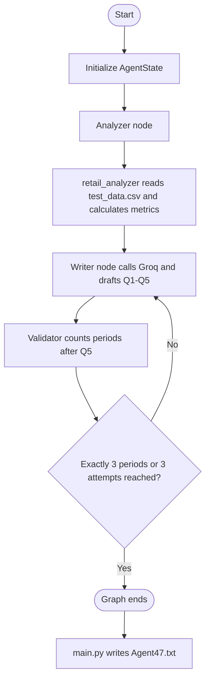

# Retail Analytics Agent

This project analyzes retail order data and asks a Groq-hosted language model to turn the results into a short, structured report. It uses a LangGraph workflow to connect data analysis, report writing, and a sentence-count validation loop.

## Architecture

This is one LangGraph agent composed of three specialized nodes, not a group of independent agents. `main.py` orchestrates the graph and calls the Groq language model; `tools.py` performs the deterministic pandas analysis. The graph passes results between nodes through a shared `AgentState`:

- `analysis_data` holds the metrics returned by the analyzer.
- `report` holds the latest model response.
- `sentence_count` holds the validator's count of periods after `Q5:`.
- `iterations` tracks how many times the writer has run.

### Node Responsibilities

- **Analyzer (`analyze_data_node`)** calls `retail_analyzer("test_data.csv")`. It returns the calculated Q1-Q4 metrics and summary statistics for the writer.
- **Retail analysis tool (`retail_analyzer` in `tools.py`)** reads and cleans the CSV, calculates revenue, delivery-time averages, data-quality counts, and return rates. It does not call the language model.
- **Writer (`write_report_node`)** formats the analyzer output as Q1-Q5 using `llama-3.3-70b-versatile` through `ChatGroq`. Its prompt requests exactly three sentences in Q5, and each run increments `iterations`.
- **Validator (`validate_node`)** counts periods in the text after the last `Q5:` marker and records the result in `sentence_count`.
- **Router (`should_continue`)** ends the graph when Q5 has exactly three periods or the writer has run three times. Otherwise, it sends the state back to the writer.
- **Output step (`__main__` in `main.py`)** runs the compiled graph and writes the final response to `Agent47.txt`, replacing the file on each run. This generated file is ignored by Git.

## Project Flow



At runtime, the initial state starts with empty analysis/report values and a zero sentence count. Each node returns only the state fields it updates, and LangGraph carries those updates forward. If validation fails before the third attempt, the writer runs again with the analysis data. The prompt is unchanged on retries; the validator's count is not included as feedback. The graph stops after the third writer run even if the sentence check still fails.

## Analysis

The analyzer loads `test_data.csv`, normalizes its column names, and calculates:

- **Q1:** Total estimated revenue by product category: quantity multiplied by unit price and adjusted for the discount percentage.
- **Q2:** Average delivery days by customer region.
- **Q3:** Counts of duplicate order IDs, quantities above 1,000, unit prices containing non-numeric formatting, discounts outside 0-100, and null cells.
- **Q4:** Return rate by payment method.
- **Q5 context:** Descriptive statistics from the cleaned data, provided to the language model so it can write the final summary.

For the calculations, currency symbols and commas are stripped from unit prices. Invalid numeric values in unit price, quantity, and discount are coerced and filled with zero. The analyzer expects columns for `order_id`, `quantity`, `unit_price`, `discount_percent`, `product_category`, `customer_region`, `delivery_days`, `return_status`, and `payment_method`. The `train_data.csv` file is included in the repository but is not currently read by the program.

## Requirements

- Python 3.10 or newer
- A Groq API key
- Internet access when generating a report, because the language model is called through Groq

## Setup

From this directory, run these commands in PowerShell:

```powershell
py -m venv .venv
.\.venv\Scripts\Activate.ps1
python -m pip install -r requirements.txt
Copy-Item .env.example .env
```

Set `GROQ_API_KEY` in `.env` to your own key. Keep that file private; it is excluded from Git.

## Run

```powershell
python main.py
```

The report is written to `Agent47.txt` in the current project directory. The program then prints a completion message in the terminal.

## Data and Limitations

The application reads `test_data.csv` using a relative path, so run it from the project directory. The analyzer requires the columns listed above. The sentence validator is intentionally simple: it counts periods after `Q5:` and does not fully understand sentence boundaries. The graph also stops after three attempts even if the generated Q5 still does not meet the requested count. Model output can vary between runs.

## Repository Files

- `main.py` defines the agent state, graph nodes, retry flow, and command-line entry point.
- `tools.py` contains the retail CSV analysis function.
- `test_data.csv` is the dataset currently analyzed by the program.
- `train_data.csv` is an additional dataset not currently consumed by the program.
- `.env.example` documents the required environment variable without containing a working key.
- `requirements.txt` lists the Python packages needed to run the project.